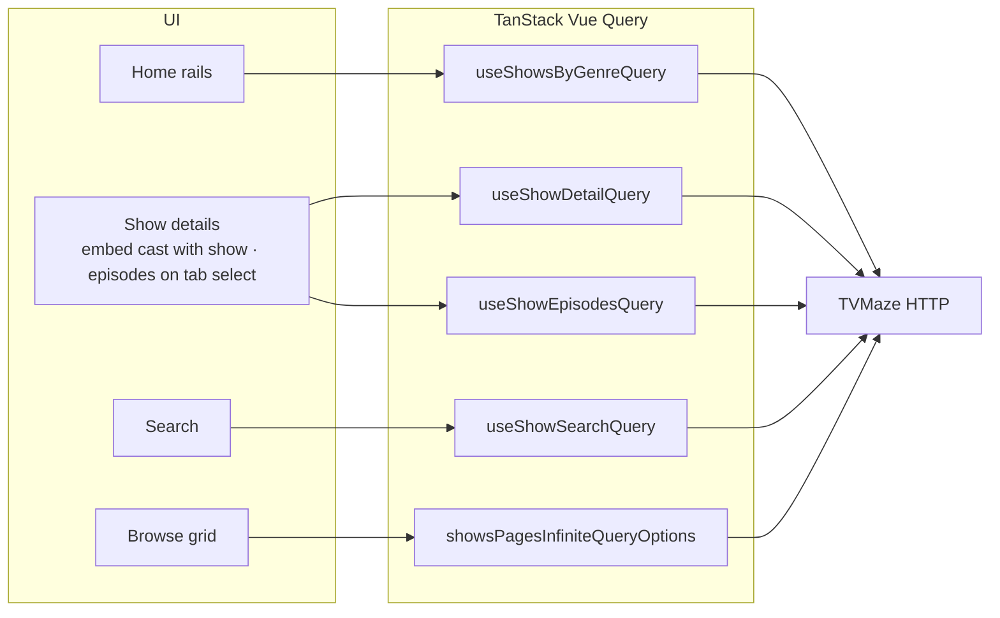

# TV Show Dashboard

Browse and search television series powered by the public [TVMaze API](https://www.tvmaze.com/api): a responsive dashboard with genre-based discovery, full show pages, and fast search.

## Live Demo

[ShowIndex on Vercel](https://show-index.vercel.app/)

## Features by page

### Home (`/`)

- Fetches the TVMaze **show index** and builds **one horizontal rail per genre**, with titles **sorted by rating** (highest first; title as tie-breaker).
- **Loading**, **error**, and **empty** states so the first paint never feels broken.
- Each tile links to the show’s detail route.

### Search (`/search`)

- **Name search** with an accessible labeled field and **debounced** queries to limit API calls.
- Result states for **initial hint**, **in progress**, **error**, **no matches**, and the results grid.

### Browse (`/browse`)

- Explores the catalog via **paginated show index** requests: **load more** wires **Intersection Observer** to a **scroll anchor** under the grid, so **additional API calls run as you scroll** when that marker enters the viewport.
- **Multi-select genre filters** with a clear action; selections persist in **Pinia** while you move around the app.
- **Prefetch** logic for sparse filter combinations so the grid can fill without extra taps.
- Loading, error, and tailored empty states.

### Show details (`/show-details/:id`)

- **Hero** with a **show poster**, summary, genres, and rating.
- **Tabs**: **Related** (other highly rated titles that share genres), **Details** (cast from the same show request via `embed=cast`), **Episodes** (fetches `/shows/:id/episodes` when you select the tab—the panel mounts on demand).
- Handles **invalid IDs**, **loading**, and **fetch errors** explicitly.

Global **primary navigation** (home, browse, search) lives in the app chrome; details and inner flows use **back** affordances where appropriate.

## State management (core design choice)

The app deliberately **splits server state and client UI state** instead of folding everything into one store.

### Why two tools

| Concern                                                                                     | Tool                   | Role                                                                                                                                              |
| ------------------------------------------------------------------------------------------- | ---------------------- | ------------------------------------------------------------------------------------------------------------------------------------------------- |
| **Remote data** — what the API returned, when it was fetched, cache freshness, retries      | **TanStack Vue Query** | Single source of truth for HTTP-backed data; query keys describe _what_ was fetched; components stay declarative.                                 |
| **Local UI state** — not the API payload, but choices that should survive a few navigations | **Pinia**              | Browse **genre filter selection** is the main example: it is user intent, not a REST resource, and should not be re-derived from Vue Query cache. |

### Decisions this enables

1. **No duplicated fetch logic** — Loading, error, refetch, and stale-while-revalidate behavior live in query defaults (`shared/providers/vue-query.ts`) and per-query options, not scattered in components.
2. **Predictable caching** — List, detail, and search endpoints each have stable keys (`shared/api/query-keys.ts`); derived lists (e.g. genre rails) use Vue Query `select` so transforms stay composable and testable.
3. **Clear mental model for contributors** — If it came over the wire and could be shared across routes, it belongs in Vue Query. If it is a **user toggle or filter** that is cheap to hold locally, it belongs in Pinia.
4. **Easier testing** — Pure mappers and stores can be unit-tested without mounting a network stack; query hooks are tested with controlled clients/mocks.

This separation is intentional: it keeps **server contracts** (URLs, JSON shapes, caching) away from **interaction state** (what the user filtered on last), which stays stable as the API or screens evolve.

## Tech stack

- **Vue 3 + TypeScript** — Composition API, strict typing at boundaries.
- **Vite** — Dev and build tooling.
- **Vue Router** — Lazy-loaded routes for smaller initial bundles.
- **Pinia** — Client/UI state (see [State management](#state-management-core-design-choice)).
- **TanStack Vue Query** — Server state, caching, retries, infinite queries.
- **Tailwind CSS v4** — Tokens and responsive layout (`tailwind.config.ts`).
- **vue-i18n** — Centralized copy under `src/shared/i18n/`.
- **Lucide Vue** — Icons.
- **Vitest + Vue Test Utils + Testing Library** — Unit and component tests.

## Architecture

### Folder layout

```text
src/
  components/          # Reusable UI (cards, sliders, buttons, nav)
  composables/         # Cross-feature behavior (observers, labels)
  features/            # Feature modules: home, search, show-details, browse
    home/              # Genre rails, home loading/error/empty
    browse/            # Results grid, genre filters, infinite scroll / load-more
    search/            # Search input, results, states
    show-details/      # Hero, episodes, cast, related, states
  router/              # Route table + lazy imports
  shared/
    api/               # fetch wrapper, query keys, queries, mappers (e.g. genre rails)
    i18n/              # Locale JSON + plugin setup
    providers/         # QueryClient setup for TanStack Vue Query
    types/             # TVMaze-aligned and internal types
    utils/             # Pure helpers (debounce, HTML, observers)
  stores/              # Pinia stores shared across routes (e.g. browse genre filters)
  views/               # Route-level shells (same order: nav routes, then detail, then 404)
    browse/            # `/browse`
    home/              # `/`
    not-found/         # catch-all 404
    search/            # `/search`
    show-details/      # `/show-details/:id`
  App.vue
  main.ts
  style.css
```

**Pinia** is created in `main.ts` (`createPinia()`). Store modules live under `stores/` and are used from home, browse, and show details where needed.

### Principles

1. **Views are thin** — They compose `features/*` and handle route props; heavy UI lives in feature folders.
2. **API boundary is typed** — `fetchApi` throws `ApiError`; mappers turn API shapes into UI-ready models.
3. **Genre rails are derived data** — `buildGenreRails` in `shared/api/utils.ts` builds per-genre lists from the show index; a show appears under every genre label TVMaze provides (there is no separate “primary genre” field).

### Data flow (high level)



### API base URL

The client uses `https://api.tvmaze.com`, injected as `apiBaseUrl` in `vite.config.ts` (see `fetch.ts`).

## How to run

### What you need

- **Node.js**: **20+** recommended (Vite 8 / current toolchain). Verified with **Node v24.11.1**.
- **npm**: **10+** works; verified with **npm 11.6.2**.

### Commands

```bash
npm install          # install dependencies
npm run dev          # dev server → http://localhost:5173
npm run build        # vue-tsc + production bundle
npm run preview      # locally serve the production build
npm run lint         # ESLint
npm run format       # Prettier (check)
npm run format:write # Prettier (fix)
```

### Tests

```bash
npm test             # Vitest watch mode
npm run test:unit    # single run (CI-friendly)
npm run test:coverage
```

## Testing strategy

- **Runner**: Vitest with `@vitejs/plugin-vue` (see `vite.config.ts` — tests use the `node` environment).
- **What is covered**
  - **Pure logic**: genre rail building, sorting, slugs, debounce, HTML utilities, types.
  - **API layer**: `fetchApi` behavior, query key stability, query hooks (mocked network).
  - **Stores**: `stores/useBrowseFiltersStore` (genre filter selection).
  - **Components/features**: rails, search and browse sections, show detail states, nav/app smoke behavior.
