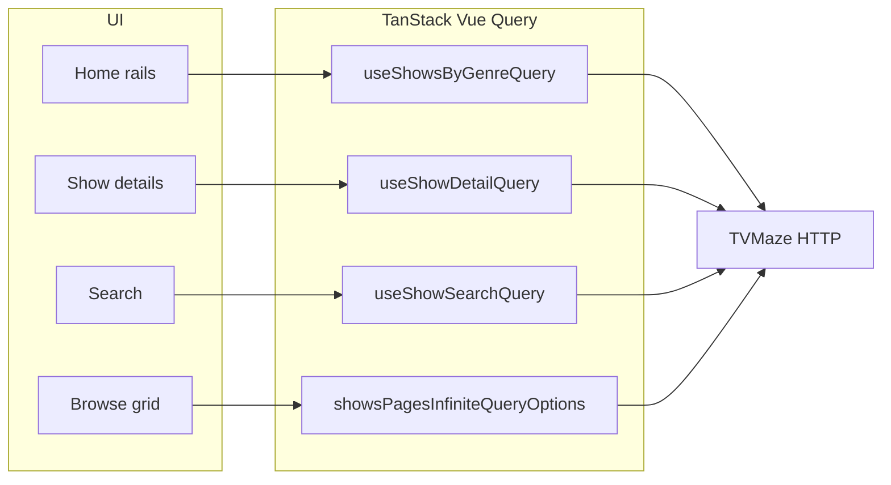

# TV Show Dashboard

A Vue 3 TV show browser for a **frontend developer assessment**: genre-grouped rails on the home screen (sorted by rating), show details, name search, and an optional browse experience—all backed by the public [TVMaze API](https://www.tvmaze.com/api).

## Assignment fit

This project implements the brief’s core requirements and documents how each is addressed.

| Requirement                                     | Implementation                                                                                                 |
| ----------------------------------------------- | -------------------------------------------------------------------------------------------------------------- |
| **Vue.js**                                      | Vue 3, Composition API, `<script setup>`, TypeScript                                                           |
| **Horizontal lists by genre**                   | Home: each genre is a horizontal rail (`HorizontalSlider` + `Rail`) built from the show index                  |
| **Sort by rating**                              | Genre rails sort shows by `rating.average` descending (ties broken by title) in `buildGenreRails`              |
| **Show details**                                | `/show-details/:id` loads a show with embedded relations where useful (cast, episodes, etc.)                   |
| **Search by name**                              | `/search` uses TVMaze `/search/shows` with Vue Query; empty, loading, and error states                         |
| **No dedicated “by genre” API**                 | Genres are **derived client-side** from the [Show index](https://www.tvmaze.com/api#show-index) paginated data |
| **Responsive, mobile-friendly**                 | Tailwind breakpoints, touch-friendly controls, layout that works from narrow to wide                           |
| **Minimal scaffolding / own structure**         | Standard Vite + Vue starter only; features, API layer, and UI composed in-repo                                 |
| **Unit tests**                                  | Vitest + Testing Library + Vue Test Utils (see [Testing strategy](#testing-strategy))                          |
| **README with architecture + run instructions** | This file                                                                                                      |
| **Simple, eye-catching UI**                     | Dark theme, consistent typography tokens, cards and rails with clear hierarchy                                 |

**Extra (beyond the brief):** **Browse** (`/browse`) — paginated index of shows with genre-style filters and infinite-style loading for exploring the catalog.

## Tech stack and why

- **Vue 3 + TypeScript** — Matches the employer stack preference; Composition API keeps logic colocated yet extractable.
- **Vite** — Fast dev/build; no heavy custom tooling.
- **Vue Router** — Route-based code splitting for details, search, browse, and home.
- **Pinia** — Only for **client/UI state** that is not server-backed (e.g. browse filter preferences in `useBrowseFiltersStore`).
- **TanStack Vue Query** — **Server state**: caching, stale times, retries, and derived `select` transforms (e.g. turning raw shows into genre rails). Avoids duplicating fetch lifecycle in components.
- **Tailwind CSS v4** — Design tokens in `tailwind.config.ts`, utility-first responsive layout.
- **vue-i18n** — User-visible strings centralized under `src/shared/i18n/` (no hardcoded copy in components where it matters).
- **Lucide Vue** — Lightweight icons for nav affordances.
- **Vitest** — Same ESM/TS pipeline as Vite; fast unit and component tests.

## Architecture

### Folder layout

```text
src/
  components/          # Reusable UI (cards, sliders, buttons, nav)
  composables/         # Cross-feature behavior (observers, labels)
  features/            # Feature modules: home, search, show-details, browse
    home/              # Genre rails, home loading/error/empty
    search/            # Search input, results, states
    show-details/      # Hero, episodes, cast, related, states
    browse/            # Grid, filters, infinite pages, Pinia store
  views/               # Route-level shells wiring features to the router
  router/              # Route table + lazy imports
  shared/
    api/               # fetch wrapper, query keys, queries, mappers (e.g. genre rails)
    providers/         # Pinia + QueryClient setup
    types/             # TVMaze-aligned and internal types
    utils/             # Pure helpers (debounce, HTML, observers)
    i18n/              # Locale JSON + plugin setup
  App.vue, main.ts, style.css
```

### Principles

1. **Views are thin** — They compose `features/*` and handle route props; heavy UI lives in feature folders.
2. **API boundary is typed** — `fetchApi` throws `ApiError`; mappers turn API shapes into UI-ready models.
3. **Genre rails are pure data** — `buildGenreRails` in `shared/api/utils.ts` takes the show index page(s) and outputs per-genre lists sorted by rating (TVMaze does not expose “primary” genre; a show appears under every genre label it has).
4. **Server vs client state** — Vue Query owns fetched data; Pinia owns filter/UI toggles that should not be lost on navigation within browse.

### Data flow (high level)



### API base URL

The client targets `https://api.tvmaze.com` via Vite’s `define.apiBaseUrl` in `vite.config.ts` (see `fetch.ts`).

## How to run

### Prerequisites

- **Node.js**: **20+** recommended (Vite 8 / current toolchain). The project was verified with **Node v24.11.1**.
- **npm**: **10+** works; verified with **npm 11.6.2**.

### Commands

```bash
npm install          # install dependencies
npm run dev          # dev server → http://localhost:5173
npm run build        # vue-tsc + production bundle
npm run preview      # serve the production build locally
npm run lint         # ESLint
npm run format       # Prettier (check)
npm run format:write # Prettier (fix)
```

### Tests

```bash
npm test             # Vitest watch mode
npm run test:unit    # single run (CI-friendly)
npm run test:coverage
```

## Testing strategy

- **Runner**: Vitest with `@vitejs/plugin-vue` (see `vite.config.ts` — tests use the `node` environment).
- **What is covered**
  - **Pure logic**: genre rail building, sorting, slugs, debounce, HTML utilities, types.
  - **API layer**: `fetchApi` behavior, query key stability, query hooks (mocked network).
  - **Stores**: browse filter store.
  - **Components/features**: rails, search and browse sections, show detail states, nav/app smoke behavior.
- **What is not claimed**: full E2E in a browser; the focus is fast, deterministic unit/component tests with mocks.
